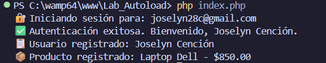

# 🚀 Implementación de Autoload PSR-4 con Composer en PHP

> **Desarrollo de Software VII** — Universidad Tecnológica de Panamá  
> Facultad de Ingeniería en Sistemas Computacionales  
> I Semestre 2026

---

## 📋 Descripción

Este proyecto implementa la **Carga Automática (Autoload)** bajo el estándar **PSR-4** utilizando Composer, eliminando el uso de `include` y `require` manuales en favor de un sistema de carga bajo demanda organizado y escalable.

---

## ⚙️ Requisitos Previos

- PHP >= 8.0
- [Composer](https://getcomposer.org/) instalado globalmente

Verificar instalación:

```bash
php -v
composer -V
```

---

## 📦 Instalación

### 1. Clonar el repositorio

```bash
git clone https://github.com/Joscen11/Lab_Autoload.git
cd Lab_Autoload
```

### 2. Generar el autoloader

```bash
composer install
```

> Si solo necesitas regenerar el mapa de clases sin instalar dependencias:

```bash
composer dump-autoload
```

### 3. Ejecutar el proyecto

```bash
php index.php
```

---

## 🗂️ Estructura de Archivos

```
Lab_Autoload/
│
├── composer.json                    # Configuración del proyecto y autoload PSR-4
├── .gitignore                       # Excluye vendor/ del control de versiones
├── README.md
│
├── src/                             # Código fuente — namespace App\
│   ├── Models/
│   │   ├── Usuario.php              # App\Models\Usuario
│   │   └── Producto.php             # App\Models\Producto
│   └── Services/
│       ├── AuthService.php          # App\Services\AuthService
│       └── RegistroService.php      # App\Services\RegistroService
│
├── index.php                        # Punto de entrada — carga vendor/autoload.php
│
└── vendor/                          # Generado por Composer (NO se sube al repo)
    └── autoload.php
```

### Relación Namespace ↔ Carpeta física

| Namespace prefix      | Carpeta física       |
|-----------------------|----------------------|
| `App\`                | `src/`               |
| `App\Models\`         | `src/Models/`        |
| `App\Services\`       | `src/Services/`      |

---

El mapeo directo es:
```
App\Models\Usuario          →  src/Models/Usuario.php
App\Models\Producto         →  src/Models/Producto.php
App\Services\AuthService    →  src/Services/AuthService.php
App\Services\RegistroService→  src/Services/RegistroService.php
```

---

## 🔧 Configuración de Composer (`composer.json`)

```json
{
    "name": "joselyn/lab_autoload",
    "description": "Proyecto de autoload con PSR-4 en PHP",
    "type": "1.0.0",
    "autoload": {
        "psr-4": {
            "App\\": "src/"
        }
    },
    "authors": [
        {
            "name": "Joscen11",
            "email": "nightmorning1572@gmail.com"
        }
    ],
    "require": {}
}
```

> Esto permite que **todas las clases** dentro de `src/` se carguen automáticamente usando el namespace correspondiente, sin ningún `include` o `require` adicional.

---

## 💻 Ejemplos de Código

### Punto de entrada (`index.php`)

```php
<?php

require_once __DIR__ . '/vendor/autoload.php';

use App\Models\Usuario;
use App\Models\Producto;
use App\Services\AuthService;
use App\Services\RegistroService;

// Crear objetos
$usuario  = new Usuario('Joselyn Cención', 'joselyn28c@gmail.com');
$producto = new Producto('Laptop Dell', 850.00);

// Usar servicios
$auth     = new AuthService();
$registro = new RegistroService();

$auth->login($usuario);
$registro->registrarUsuario($usuario);
$registro->registrarProducto($producto);
```

---

### Modelo `src/Models/Usuario.php`

```php
<?php

namespace App\Models;

class Usuario
{
    private string $nombre;
    private string $email;

    public function __construct(string $nombre, string $email)
    {
        $this->nombre = $nombre;
        $this->email  = $email;
    }

    public function getNombre(): string { return $this->nombre; }
    public function getEmail(): string  { return $this->email;  }
}
```

---

### Modelo `src/Models/Producto.php`

```php
<?php

namespace App\Models;

class Producto
{
    private string $nombre;
    private float  $precio;

    public function __construct(string $nombre, float $precio)
    {
        $this->nombre = $nombre;
        $this->precio = $precio;
    }

    public function getNombre(): string
    {
        return $this->nombre;
    }

    public function getPrecio(): float
    {
        return $this->precio;
    }

    public function __toString(): string
    {
        return "{$this->nombre} - $" . number_format($this->precio, 2);
    }
}
```

---

### Servicio `src/Services/AuthService.php`

```php
<?php

namespace App\Services;

use App\Models\Usuario;

class AuthService
{
    private ?Usuario $usuarioActual = null;

    public function login(Usuario $usuario): bool
    {
        if (empty($usuario->getEmail())) {
            echo "❌ Error: el email no puede estar vacío." . PHP_EOL;
            return false;
        }

        $this->usuarioActual = $usuario;
        echo "🔐 Iniciando sesión para: " . $usuario->getEmail() . PHP_EOL;
        echo "✅ Autenticación exitosa. Bienvenido, " . $usuario->getNombre() . "." . PHP_EOL;

        return true;
    }

    public function logout(): void
    {
        if ($this->usuarioActual === null) {
            echo "⚠️  No hay ningún usuario autenticado." . PHP_EOL;
            return;
        }

        echo "👋 Cerrando sesión de: " . $this->usuarioActual->getNombre() . PHP_EOL;
        $this->usuarioActual = null;
    }

    public function estaAutenticado(): bool
    {
        return $this->usuarioActual !== null;
    }

    public function getUsuarioActual(): ?Usuario
    {
        return $this->usuarioActual;
    }
}

---

### Servicio `src/Services/RegistroService.php`

```php
<?php

namespace App\Services;

use App\Models\Usuario;
use App\Models\Producto;

class RegistroService
{
    public function registrarUsuario(Usuario $usuario): void
    {
        echo "📋 Usuario registrado: " . $usuario->getNombre() . PHP_EOL;
    }

    public function registrarProducto(Producto $producto): void
    {
        echo "📦 Producto registrado: " . $producto . PHP_EOL;
    }
}
```

---

## ✅ Pruebas de Ejecución

### 1. Ejecutar `composer dump-autoload`


### 2. Ejecutar `php index.php`




> Sin errores de `Class not found` — el autoloader resuelve cada clase automáticamente en tiempo de ejecución.

---

## 📝 Conclusiones Técnicas

### 1. Mantenibilidad
Con PSR-4, agregar una nueva clase al proyecto solo requiere crear el archivo PHP con el namespace correcto. **No es necesario modificar ningún archivo de configuración global** ni agregar sentencias `include`. Composer descubre la clase automáticamente gracias al mapeo de prefijos en `composer.json`, lo que reduce el riesgo de errores y facilita el trabajo en equipo.

### 2. Eficiencia de Memoria — *Lazy Loading*
El autoloader de Composer implementa **carga bajo demanda**: una clase solo se carga en memoria en el momento en que se instancia por primera vez. Esto significa que proyectos con decenas de clases no incurren en el costo de cargar todo el código al inicio de cada petición, mejorando el tiempo de respuesta y reduciendo el consumo de memoria del servidor PHP.

### 3. Estandarización y Trabajo Colaborativo
El estándar **PSR-4** es adoptado universalmente en el ecosistema PHP (Laravel, Symfony, WordPress, etc.). Seguirlo garantiza que cualquier desarrollador que se incorpore al proyecto comprenda de inmediato la estructura de carpetas, los namespaces y cómo invocar clases, eliminando la curva de aprendizaje asociada a convenciones ad-hoc.

---

## 🛡️ .gitignore

```gitignore
/vendor/
```

> La carpeta `vendor/` **no se incluye** en el repositorio. Al clonar el proyecto, ejecutar `composer install` para regenerarla localmente.

---

## 👩‍💻 Autor

* 👤 Nombre: Joselyn Cención
* 👩‍🏫 Instructora: Ing. Irina Fong
* 📅 Fecha: 3 de Mayo, 2026